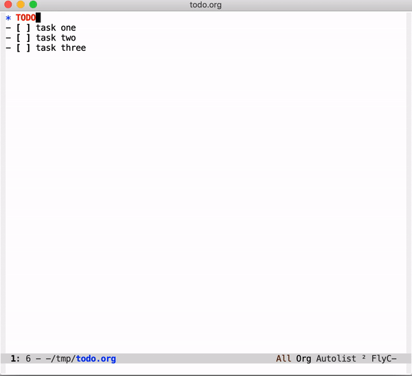
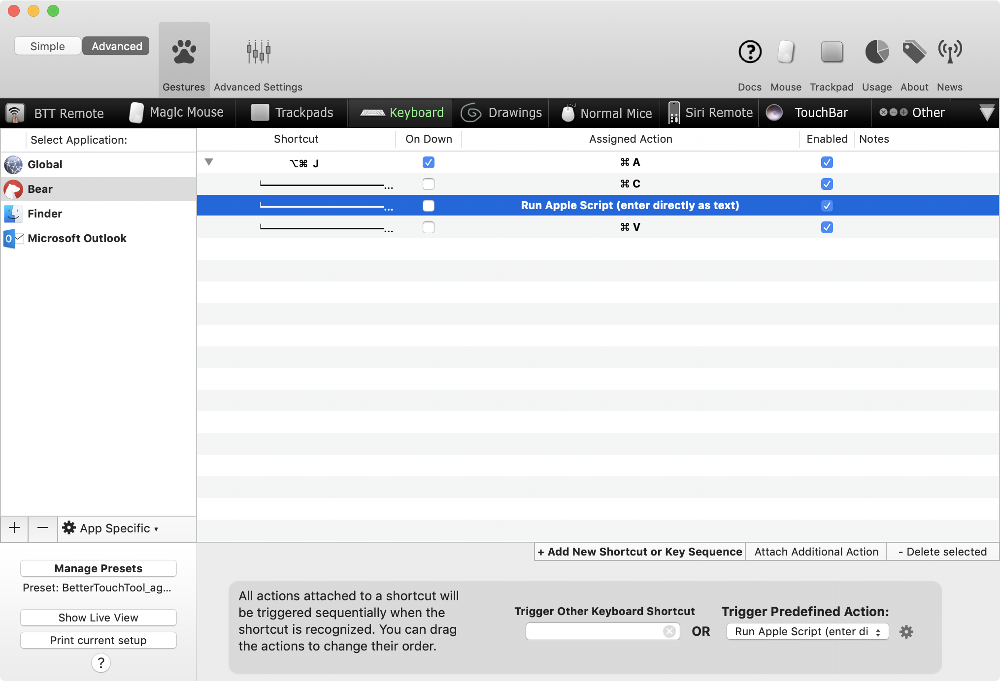
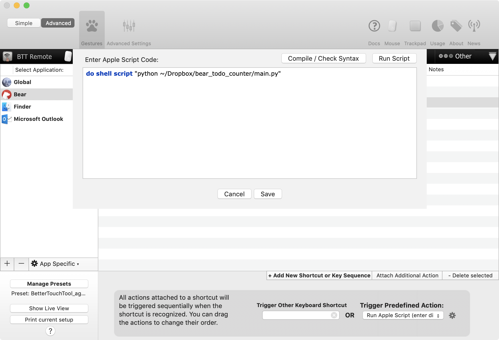

# bear_todo_counter

[](https://travis-ci.com/attomos/bear_todo_counter)
<a href='https://coveralls.io/github/attomos/bear_todo_counter?branch=master'></a>
<a href="https://github.com/psf/black"></a>

Put a TODO progress in [Bear][bear] note's title.

## Motivation
Inspired by [org-mode][org-mode]'s [subtasks progress][org-mode-tasks], this simple Python script will:
1. read the text from clipboard
2. count number of completed items and total items
3. set the clipboard with the original text with TODO progress in the first line

### Org mode Subtasks Progress


### :bear: with bear_todo_counter


Or leave it empty and use the [link text itself].


## Usage

I trigger this script using [BetterTouchTool][btt] with a simple sequence of actions.  
Screenshots below should explain everything.





## Running tests
```bash
# in virutalenv or whatever env management of your choice
pip install -r requirements.txt

pytest
pytest --cov  # with coverage
```

[bear]: https://bear.app/
[org-mode]: https://orgmode.org/
[org-mode-tasks]: https://orgmode.org/manual/Breaking-down-tasks.html
[btt]: https://folivora.ai/
